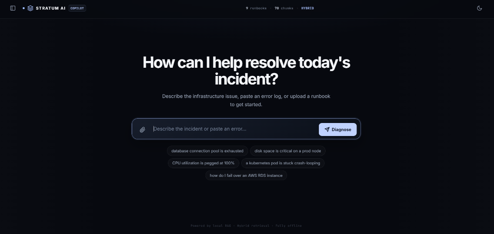
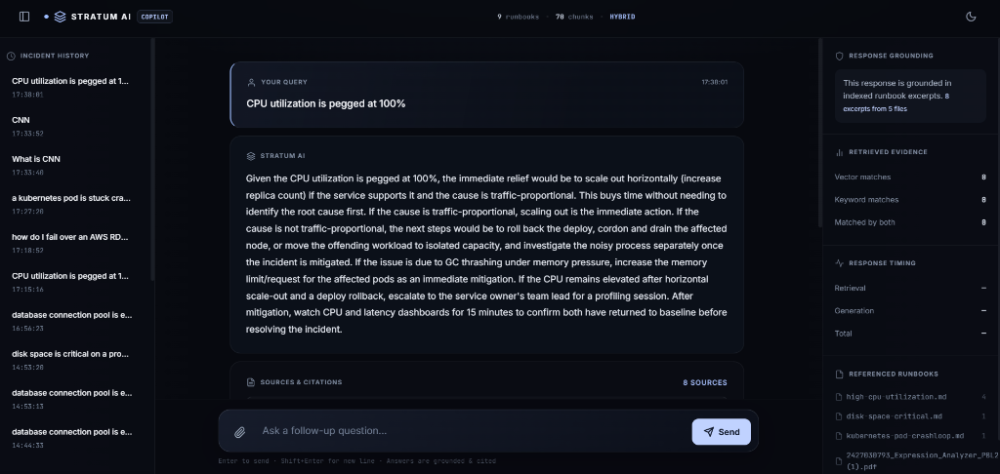
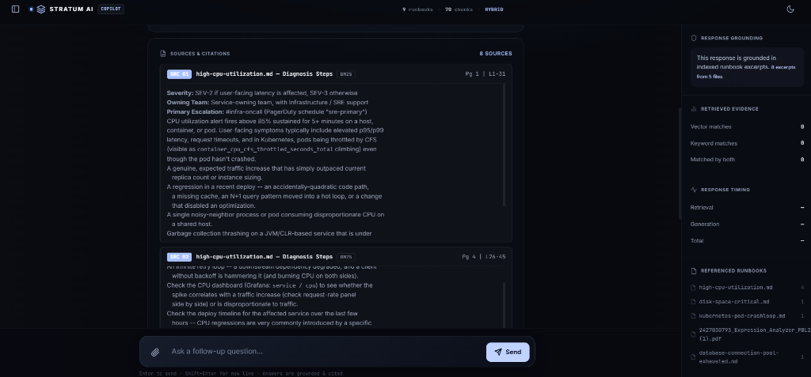

<div align="center">

</div>

<div align="center">

[](https://git.io/typing-svg)

<br/>


</div>

<p align="center">
<sub>HPE Hackathon submission for <strong>#11: Runbook Chatbot Using Retrieval-Augmented Generation</strong> (AIOps / Knowledge Management)</sub>
</p>

<div align="center">

──────────────────────────────

</div>

Answers on-call questions like *"what do I do if the database connection pool is exhausted?"* with a specific, grounded answer citing the exact runbook file, section, page number, and line range it came from — fully local, no external API calls, no API keys.

<br/>

<div align="center">

## Architectural Model

**Full Pipeline Overview**

</div>

```
┌──────────────────────────────────────────────────────────────────────────────────┐
│                         STRATUM AI — RUNBOOK CHATBOT                             │
├─────────────────┬────────────────────────────────┬───────────────────────────────┤
│   INGESTION     │        RETRIEVAL               │         GENERATION            │
│                 │                                │                               │
│  runbooks/      │  ┌─────────────┐              │  ┌─────────────────────────┐  │
│  (.md, .pdf,   ─┼─▶│  Embedder   │──FAISS───────┼─▶│  Cross-Encoder Reranker │  │
│   .docx, .pptx) │  │  MiniLM-L6  │              │  │  (bge-reranker-base)    │  │
│                 │  └─────────────┘              │  └────────────┬────────────┘  │
│  ingest.py      │                                │               │               │
│  ┌───────────┐  │  ┌─────────────┐              │  ┌────────────▼────────────┐  │
│  │  Chunker  │  │  │  BM25 Okapi │──BM25────────┼─▶│  Prompt Builder         │  │
│  │  (struct- │  │  │  (sparse)   │              │  │  (XML-delimited, prompt │  │
│  │  aware)   │  │  └─────────────┘              │  │   injection hardened)   │  │
│  └───────────┘  │          │                    │  └────────────┬────────────┘  │
│       │         │          ▼                    │               │               │
│       ▼         │  Reciprocal Rank Fusion (RRF) │  ┌────────────▼────────────┐  │
│  index_store/   │          │                    │  │  Qwen2.5-3B-Instruct    │  │
│  faiss.index    │          ▼                    │  │  (GGUF / llama-cpp)     │  │
│  bm25.pkl       │  Top-K candidates + Rerank    │  │  SSE streaming tokens   │  │
│  chunks.json    │                               │  └────────────┬────────────┘  │
└─────────────────┴────────────────────────────────┴──────────────┼───────────────┘
                                                                   ▼
                                                        static/index.html
                                                  (ChatGPT-style UI with:
                                                   • Incident History sidebar
                                                   • Dark / Light theme toggle
                                                   • Expandable source citations
                                                     with page numbers + line ranges
                                                   • SSE token streaming)
```

<br/>

**Key Components**

| Layer | Technology | Purpose |
|:---|:---|:---|
| **Embedding Model** | `MiniLM-L6-v2` (local, offline) | Dense vector search |
| **Sparse Retrieval** | `BM25Okapi` (rank-bm25) | Keyword / exact-string matching |
| **Vector Index** | `FAISS IndexFlatIP` | Cosine similarity search |
| **Fusion** | Reciprocal Rank Fusion (RRF, k=60) | Combine dense + sparse rankings |
| **Reranker** | `bge-reranker-base` (cross-encoder) | Re-score top-K candidates |
| **LLM** | `Qwen2.5-3B-Instruct` GGUF (llama-cpp-python) | Response generation |
| **Backend** | FastAPI + SSE streaming | API server |
| **Frontend** | Vanilla HTML/CSS/JS (single file) | Chat UI |
| **Security** | XML-delimited prompt injection defense | Prevent jailbreaks |

<br/>

**Why this design**

<details open>
<summary><strong>Structure-aware chunking, not fixed windows</strong></summary>
<br/>

`ingest.py` splits each runbook on its own Markdown headings (`#` = doc title, `##` = section), so a citation always points at a real, meaningful unit — "Remediation Steps", not "characters 4200–4800". Oversized sections are further split with word overlap so nothing blows the LLM's context.
</details>

<details>
<summary><strong>Hybrid retrieval, because pure semantic search misses exact strings</strong></summary>
<br/>

On-call engineers paste literal error text (`ECONNREFUSED`, `FATAL: sorry, too many clients already`, a specific exception class). Dense embedding search alone is often weak on these; BM25 alone is weak on paraphrased/plain-language questions. We run both (FAISS cosine + BM25 Okapi) and combine them with **Reciprocal Rank Fusion**, which needs each retriever's ranks, not comparable score scales.
</details>

<details>
<summary><strong>The model can't invent an answer</strong></summary>
<br/>

If the top retrieval confidence is below `CONFIDENCE_THRESHOLD`, the LLM is never even called — the UI shows an explicit "no confident match, escalate" card. For an incident tool, a wrong remediation step is worse than an honest "I don't know."
</details>

<details>
<summary><strong>Every citation is checkable</strong></summary>
<br/>

The system prompt requires `[Source N]` inline citations; the UI turns those into clickable cards showing the exact file, section, **page number**, and line range — nothing is taken on faith.
</details>

<details>
<summary><strong>Prompt injection hardened</strong></summary>
<br/>

User queries are XML-delimited inside `<user_query>` tags and any injected XML tags are stripped before sending to the LLM. The system prompt contains an explicit SECURITY PROTOCOL instructing the model to ignore persona-override attempts within the query.
</details>

<details>
<summary><strong>100% local</strong></summary>
<br/>

Embeddings (MiniLM-L6-v2), generation (Qwen2.5-3B-Instruct GGUF via `llama-cpp-python`), FAISS, and BM25 all run on your machine. Good fit for an internal ops tool that shouldn't ship incident details to a third-party API.
</details>

<br/>

<div align="center">

──────────────────────────────

## Project Layout

</div>

```
hpe-runbook-main/
├── requirements.txt
├── install.bat               # one-click setup: deps + models + index build
├── START_APP.bat             # launch the backend server
├── ingest.py                 # builds the indexes from runbooks/
├── server.py                 # FastAPI backend: hybrid retrieval + local LLM + SSE
├── pipeline/
│   ├── chunker.py            # structure-aware chunker (md, pdf, docx, pptx)
│   ├── embedder.py           # MiniLM-L6-v2 encoder singleton
│   ├── reranker.py           # bge-reranker-base cross-encoder
│   ├── retriever.py          # parallel hybrid retrieval + RRF fusion
│   ├── prompt_builder.py     # prompt construction + injection defense
│   ├── compressor.py         # chunk deduplication / compression
│   └── normalizer.py         # query normalization + abbreviation expansion
├── config/
│   ├── settings.py           # all tunable constants
│   └── abbreviations.json    # SRE/DevOps abbreviation dictionary
├── runbooks/                 # your runbook knowledge base (.md, .pdf, .docx)
│   ├── database-connection-pool-exhausted.md
│   ├── disk-space-critical.md
│   ├── high-cpu-utilization.md
│   ├── kubernetes-pod-crashloop.md
│   └── aws-rds-failover.md
├── models/                   # downloaded by install.bat (not committed to git)
│   ├── MiniLM-L6-v2/
│   ├── bge-reranker-base/
│   └── Qwen2.5-3B-Instruct-Q3_K_M.gguf
├── index_store/              # generated by ingest.py
│   ├── faiss.index
│   ├── bm25.pkl
│   └── chunks.json
└── static/
    └── index.html            # the full console UI (single file, no build step)
```

<div align="center">

──────────────────────────────

## Setup

</div>

**Prerequisites**

- **Windows 10/11** (batch scripts are Windows-targeted)
- **Python 3.10 or 3.11** — must be on your system PATH
- ~6 GB free disk space for models
- Internet access **only during installation** (models are downloaded once)

<br/>

**Step 1 — Install**

Double-click **`install.bat`** or run it in a terminal:

```bat
install.bat
```

This will automatically:
1. Create a Python virtual environment (`venv/`)
2. Install all Python dependencies from `requirements.txt`
3. Download the local embedding model (`MiniLM-L6-v2`) into `models/`
4. Download the reranker model (`bge-reranker-base`) into `models/`
5. Download the GGUF LLM (`Qwen2.5-3B-Instruct-Q3_K_M.gguf`) into `models/`
6. Run `ingest.py` to chunk, embed, and index all runbooks in `runbooks/`
7. Write `index_store/faiss.index`, `index_store/bm25.pkl`, `index_store/chunks.json`

> **Note:** Installation requires a one-time internet connection. All subsequent use is fully offline.

<br/>

**Step 2 — Add your runbooks** *(optional)*

Drop `.md`, `.pdf`, `.docx`, or `.pptx` files into `runbooks/`.
Then rebuild the index:

```bat
venv\Scripts\python.exe ingest.py
```

<br/>

**Step 3 — Start the application**

Double-click **`START_APP.bat`** or run it in a terminal:

```bat
START_APP.bat
```

A terminal window will open showing the server startup logs. First startup loads the LLM into memory (takes ~10–20 seconds). Once you see:

```
INFO:     Uvicorn running on http://127.0.0.1:8000
```

Open your browser and go to **http://127.0.0.1:8000/**

<div align="center">

──────────────────────────────

## Using It

</div>

- Click one of the suggested incident chips, or type your own question.
- The response streams token-by-token from the local LLM.
- `[Source N]` markers in the answer are clickable — they scroll to and highlight the matching citation card below the message.
- Each citation card shows the **file, section, page number, line range**, whether it was found by dense search / BM25 / both, and expands on click to show the full source excerpt.
- If nothing in the index is a confident match, you'll get a red "no confident match" card instead of a guessed answer.
- Use the **theme toggle** in the top-right to switch between Dark and Light mode.
- Use the **sidebar button** in the top-left to open/close your Incident History — click any past incident to restore the full conversation.

<div align="center">

──────────────────────────────

## Tuning Knobs

<sub>top of <code>server.py</code> / <code>config/settings.py</code></sub>

</div>

| Constant | What it does |
|:---|:---|
| `TOP_K_DENSE` / `TOP_K_SPARSE` | how many candidates each retriever contributes before fusion |
| `TOP_K_FINAL_MAX` | how many fused + reranked chunks are shown to the LLM |
| `RRF_K` | Reciprocal Rank Fusion damping constant (60 is the standard default) |
| `CONFIDENCE_THRESHOLD` | minimum top-1 cosine similarity required to attempt an answer at all |
| `N_GPU_LAYERS` | `-1` offloads all LLM layers to GPU (needs the CUDA build of llama-cpp-python) |
| `RERANKER_HIGH_THRESHOLD` | score above which a chunk is always included after reranking |
| `CHUNK_MAX_WORDS` | maximum words per chunk before splitting with overlap |

<div align="center">

──────────────────────────────

## Demo Script

<sub>suggested, ~2 minutes</sub>

</div>

1. Ask the exact prompt from the challenge brief: *"what do I do if the database connection pool is exhausted?"* — show the streamed, cited answer, then click a `[Source N]` chip to show it jumps to the real runbook excerpt with the page number.
2. Ask something phrased very differently from the doc's wording (e.g. *"app is timing out talking to postgres, is that a pool problem?"*) to show dense retrieval catching paraphrased intent.
3. Paste a literal error string (e.g. *"getting FATAL: sorry, too many clients already, what now"*) to show BM25 catching the exact string — point out the amber "BM25" badge on that citation versus the cyan "DENSE+BM25" badges elsewhere.
4. Ask something not covered by any runbook (e.g. *"how do I reset a forgotten Jira password"*) to show the honest no-match / escalate card instead of a hallucinated answer.
5. Mention the status ticker: fully local stack, chunk/file counts, hybrid retrieval mode — no external API calls at any point in the pipeline.

<div align="center">

──────────────────────────────

## Extending This for Production

</div>

- Swap the sample `runbooks/` for a scheduled ingestion job pointed at your real Confluence/GitHub/S3 runbook sources.
- Swap `IndexFlatIP` for `IndexHNSWFlat` in `ingest.py` if the corpus grows past a few tens of thousands of chunks (flat search is exact but linear; HNSW trades a little recall for sub-linear search).
- Add an auth layer in front of `server.py` before exposing it beyond localhost.
- Log query → retrieved sources → answer → (optional) engineer feedback thumbs-up/down to build a dataset for evaluating and improving retrieval quality over time.

<div align="center">

──────────────────────────────

## Screenshots

<br/>

**Landing Page**



<br/><br/>

**Workspace — AI Answer with Incident History**



<br/><br/>

**Sources & Citations with Page Numbers**



</div>

<br/>

<div align="center">

</div>

<p align="center">
<sub>Built for the HPE Hackathon — 100% local, no external API calls, no API keys.</sub>
</p>
